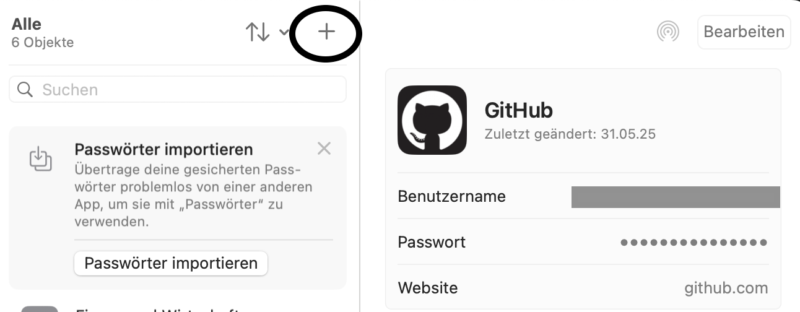
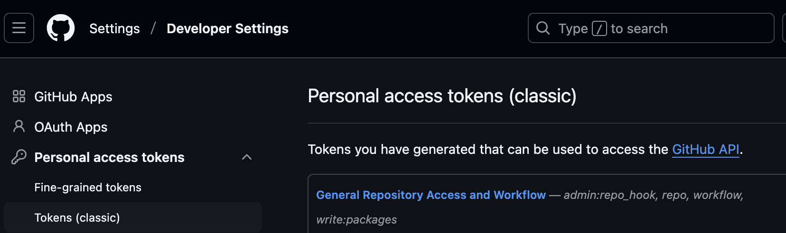
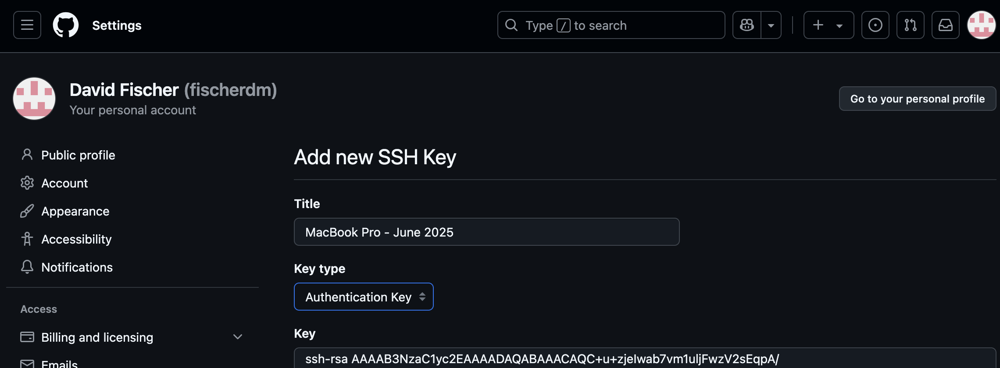
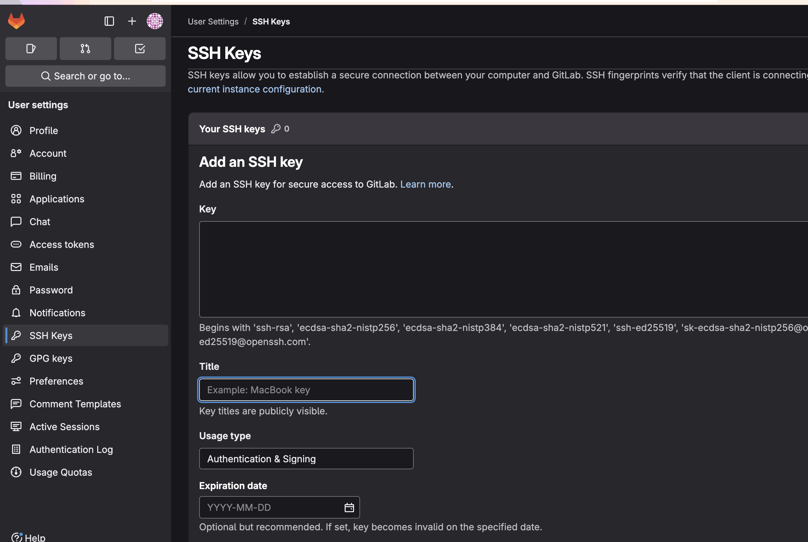
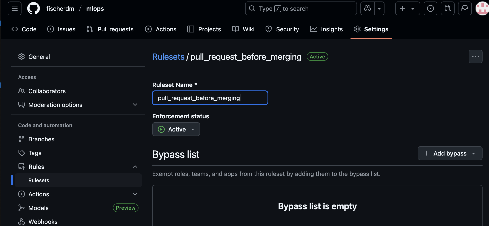
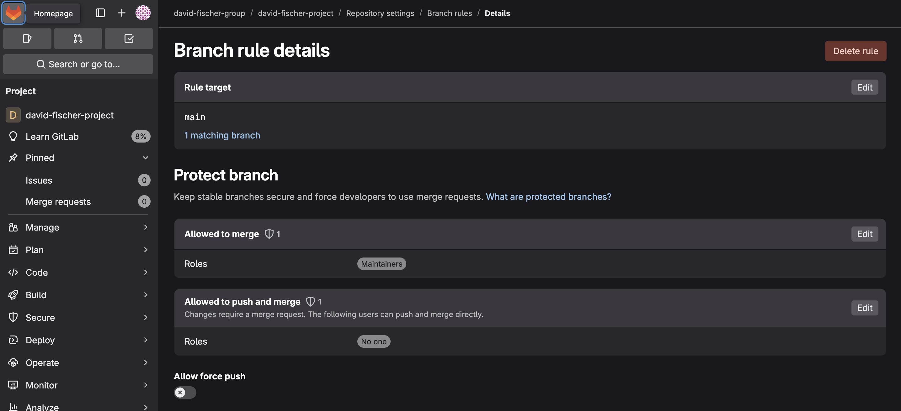

# MLOPs with Python
This repository stores useful information about MLOps. It can be used as a template and a reference.

Le Chat was a big help (https://chat.mistral.ai/chat). Other ressources are:

- https://www.coursera.org/specializations/mlops-machine-learning-duke
- Cowell, C., Lotz, N., & Timberlake, C. (2023). *Automating DevOps with GitLab CI/CD Pipelines: Build efficient CI/CD pipelines to verify, secure, and deploy your code using real-life examples.* Packt Publishing.

## 1 Setting up Git

## 1.1 Installing or upgrading Git (with Homebrew)
Before setting up the Git Credential Manager (CDM) we have to install or upgrade. We use homebrew here.

### 1.1.1 Updating and upgrading Homebrew
In the context of Homebrew, updating means fetching the latest list of available packages and versions from the Homebrew repository. This command updates Homebrew itself and the list of available formulas (packages). It ensures that your local package list is synchronized with the latest versions available in the Homebrew repository.

Upgrading with Homebrew means installing newer versions of the packages you already have installed on your system. This command upgrades all outdated packages to their latest versions based on the updated package list.

Run first 
```bash
brew update
```
and then
```bash
- brew upgrade
```

### 1.1.2 Installing or upgrading Git
Next we can either install or upgrade git

```bash
brew upgrade git
````
```bash
brew install git
```

### 1.1.3 Git configuration in case you use HTTPS to interact with Git repositories (optional)

In case you choose the https option to clone a repository, there's the possiblity to store your credentials. Let's configure the Git Credential Manager (GCM) for that.

First check your current Git configuration settings using the following command:

```bash
git config --global --list
```
Remove all existing credential helper configurations

```bash
git config --global --unset-all credential.helper
```

Set the desired credential helper
```bash
git config --global credential.helper /usr/local/share/gcm-core/git-credential-manager
```
Verify the configuration
```bash
git config --global --list | grep credential.helper
```

*On MacOS, you may have to update your KeyChain with the Credentials for GitHub (or GitLab).*



# 2 Interacting with remote repository (GitHub, GitLab, Bitbucket etc.)

## 2.1 PAT (optional) in case you interact over HTTPS

One significant advantage of using a Personal Access Token (PAT) is the ability to define and limit the rights or permissions associated with that token. When you create a PAT, you can specify the scope of access it provides. This granular control over permissions offers several benefits

### 2.1.1 Scopes for PAT (Classic) on Github

Here's a brief overview of some common scopes and their purposes on Github:
- **repo**: Full control of private repositories. This is the most commonly used scope for general Git operations.

- **repo:status**: Read-only access to commit statuses.

- **repo_deployment**: Access to manage deployment environments.

- **admin:repo_hook**: Read and write access to repository hooks.

- **workflow**: If you need to manage GitHub Actions workflows, this scope is necessary. It allows you to read, write, and manage workflows in your repositories.

- **write:packages**: For reading and writing packages published to GitHub Packages.

- **delete_repo**: For deleting repositories.

### 2.1.2 Extended Scope that should meet most needs.

**repo**:
Full control of private repositories: This scope allows you to read, write, and manage repository contents, including code, commit statuses, and pull requests. It's essential for performing most Git operations. 

Depending on your specific needs, you might also consider adding the following scopes:

**admin:repo_hook**: If you need to manage repository hooks, this scope allows you to read and write repository hooks.

**workflow**: If you are involved in managing GitHub Actions workflows, this scope allows you to manage workflows.

**write:packages**: If you need to interact with GitHub Packages, this scope allows you to read and write packages.



You have to give this token a name for instance *General Repository Access and Workflow*.

## 2.2 SSH

### 2.2.1 Improved security
SSH (Secure Shell) is generally preferred over other methods like HTTPS when it comes to security, especially for authenticating and communicating with remote servers and version control systems like GitHub and GitLab. Here are some reasons why SSH is often considered more secure:

- **Key-Based Authentication:** SSH uses key pairs (a public key and a private key) for authentication. This method is generally more secure than password-based authentication because the private key is stored securely on your machine and is not transmitted over the network.

- **Encryption:** SSH provides strong encryption for data transmitted over the network. This encryption helps protect against eavesdropping, connection hijacking, and other attacks that can intercept data.

- **No Credential Transmission:** Unlike HTTPS, which may require transmitting credentials like usernames and passwords or personal access tokens (PATs), SSH does not send any credentials over the network. This reduces the risk of credential interception.

- **Resistance to Brute Force Attacks:** SSH keys, especially when using strong passphrases and key lengths, are resistant to brute force attacks. This makes it harder for attackers to gain unauthorized access.

- **Flexibility and Control:** SSH allows for fine-grained control over access permissions and can be configured to restrict access to specific commands or operations, enhancing security.

- **Widely Trusted:** SSH is a widely used and trusted protocol for secure communication. It has been extensively tested and is considered reliable for secure data transmission.

### 2.2.2 Key generation

On Unix-based systems (Linux/macOS) you can open your terminal application and type the following command to generate a new SSH key pair. This command uses the RSA algorithm with a key size of 4096 bits, which is considered secure.

```bash
ssh-keygen -t rsa -b 4096 -C "your_email@example.com"
```
The email address used when generating an SSH key with the ssh-keygen command serves as a label or identifier for the key. It is not used for any form of communication or verification. Here are a few reasons why an email address is typically included:

- **Identification:** The email address helps identify the owner of the SSH key. This can be particularly useful in environments where multiple users might have their keys stored, such as on a shared server. It provides a quick way to determine which key belongs to which user.

- **Convention:** It is a common convention to use an email address as a comment or label in SSH keys. This practice is borrowed from other systems and protocols where an email address is used as a unique identifier.

- **Clarity:** Including an email address can provide clarity and context, especially when managing multiple keys. It helps users quickly identify the purpose or owner of a key.

- **Git Operations:** When using SSH keys with Git hosting services like GitHub or GitLab, the email address can help associate the key with your account, although the actual authentication is done through the key itself.

While the email address is not a technical requirement for the functioning of the SSH key, it is a useful practice for key management and identification purposes. If you prefer, you can use any string as a label instead of an email address. The important part is the key itself, not the label.

You can press Enter to accept the default location and enter a secure passphrase to add an extra layer of security to your key.

**Optional:**
After generating the SSH key, you can add it to the SSH agent to manage your keys and passphrases.

1. Start the SSH Agent:
```bash
eval "$(ssh-agent -s)"
```
2. Add Your SSH Private Key:
```bash
ssh-add ~/.ssh/id_rsa
```
Adding your SSH key to the SSH agent provides several benefits, primarily related to convenience and security. Here's why you might want to use the SSH agent:

- **Passphrase Management:** If your SSH private key is protected with a passphrase (which is a good security practice), you typically need to enter this passphrase every time the key is used. The SSH agent can store your decrypted private key in memory after you enter the passphrase once. This means you don't have to enter the passphrase repeatedly for subsequent SSH operations during your session.

- **Convenience:** By managing your SSH keys, the agent allows you to use them across multiple terminal sessions or applications without having to manually specify the key each time. This can be particularly useful if you frequently connect to multiple servers or use multiple keys.

- **Security:** The SSH agent keeps your private key secure in memory. The agent does not store the passphrase itself; instead, it stores the decrypted key, which is only accessible to processes you authorize. This reduces the risk of exposing your passphrase or private key.

- **Key Management:** If you use multiple SSH keys for different services or accounts, the SSH agent can manage these keys and use the appropriate one automatically based on the context of the connection. This simplifies the process of working with multiple keys.

- **Automation and Scripting:** When writing scripts or automating tasks that require SSH access, using the SSH agent can simplify authentication, as it handles the key management in the background.

**Optional:** You can check the current permissions of your private key file with the following command: 

```bash
ls -l ~/.ssh/id_rsa
```
This command will display the permissions of the id_rsa file. You should see something like -rw-------, which indicates that the file has 600 permissions. It means that only you can read or write to the file.

If for any reason the permissions are not set correctly, you can set them manually using the chmod command:
```bash
chmod 600 ~/.ssh/id_rsa
```
### 2.2.3 Add public key to GitHub or GitLab

You can opy the SSH public key by typing
```bash
cat ~/.ssh/id_rsa.pub | clip
```
on macOS you can use pbgrep instead.

Then you can go to GitHub or GitLab and store the public key. If you are on both platforms you can use the same SSH key pair for both. 

**GitHub**



**GitLab**



When adding an SSH key to your GitHub or GitLab account, the title or name you give to the key is primarily for your own reference and identification. It's not used for any functional purpose in the authentication process. Here are some tips on what to use as a title for your SSH key:

- **Descriptive Name:** Use a name that describes the purpose or origin of the key. For example, if the key is used on your personal laptop, you might name it "Personal Laptop" or "My MacBook Pro".

- **Device Name:** If the key is specific to a particular device, you can use the name or type of the device, such as "Work Desktop" or "Home PC".

- **Usage Context:** If the key is used for a specific purpose or project, you might include that in the title, such as "GitHub Projects" or "Freelance Work".

- **Date of Creation:** Including the date can help you keep track of when the key was created, which can be useful for key rotation and management. For example, "MacBook Pro - Jan 2025".

- **Combination:** You can combine the above elements to create a more descriptive title, such as "Personal Laptop - GitHub Access - 2025".

Ultimately, the title should help you quickly identify the key's purpose and origin, especially if you manage multiple SSH keys across different devices or services.

## 3 Restricting branches

Implementing restrictions so that no one can directly push to the main or master branch is generally considered a best practice in software development. This approach encourages the use of pull requests (or merge requests in GitLab), which can lead to several benefits:

- **Code Review:** By requiring pull requests, you ensure that all changes are reviewed by at least one other person. This can help catch bugs, improve code quality, and share knowledge across the team.

- **Discussion and Collaboration:** Pull requests facilitate discussion around the changes being proposed. Team members can provide feedback, suggest improvements, or ask questions, which can lead to better solutions.

- **Automated Testing:** You can integrate automated tests and checks that must pass before a pull request can be merged. This ensures that new changes do not break existing functionality.

- **Documentation:** Pull requests often require a description of what changes are being made and why. This serves as documentation that can be useful for future reference.

- **Control and Oversight:** By restricting direct pushes, you maintain better control over what gets merged into the main branch, reducing the risk of unintended or harmful changes.

### 3.1 GitHub
To implement a restriction in GitHub so that no one can directly push to the main or master branch, you need to set up branch protection rules. Here's a step-by-step guide to doing this:
1) Navigate to Your Repository:
    Go to the main page of the repository on GitHub.

2) Access Repository Settings:
    Click on the "Settings" tab near the top right of the repository page.

3) Branches Section:
    In the left sidebar of the Settings page, find and click on the "Branches" option. This is typically under the "Code and automation" section.

4) Add Branch Protection Rule:
    Click on the "Add rule" button. If you already have rules set up, you might see an "Add branch protection rule" button instead.

5) Specify Branch Name:
	In the "Branch name pattern" field, enter the name of the branch you want to protect. For example, type main or master.

6) Configure Protection Settings:
	- Require a pull request before merging: Enable this option to ensure that all changes must go through a pull request.
	- Require approvals: You can specify the number of approvals required before a pull request can be merged.
	- Require status checks to pass before merging: You can specify which status checks must pass before merging.
	- Include administrators: Decide whether to include administrators in these restrictions.
	- Restrict who can push to matching branches: You can restrict pushes to specific users, teams, or apps if needed.

7) Save Changes:
	After configuring the settings to your preference, click the "Create" or "Save changes" button to apply the branch protection rule.

By setting up these branch protection rules, you ensure that all changes to the main or master branch must go through a pull request, thereby preventing direct pushes and enhancing code quality and collaboration.



### 3.2 GitLab

In GitLab, the terms "allowed to merge" and "allowed to push and merge" refer to different levels of access control for protected branches. Here's a breakdown of what each term means:

- **Allowed to Merge:** <br>
    *Definition:* Users with this permission can create merge requests that target the protected branch. However, they cannot push changes directly to the branch.
    
	*Use Case:* This permission is useful when you want team members to propose changes through merge requests, which can then be reviewed and approved by other team members before being merged into the protected branch.

- **Allowed to Push and Merge:** <br>
    *Definition:* Users with this permission have a higher level of access. They can both push changes directly to the protected branch and merge approved merge requests into the branch.
    
	*Use Case:* This permission is typically reserved for users who have a higher level of trust and responsibility, such as project maintainers or leads, who need the ability to make direct changes to the branch.

In summary, "allowed to merge" is a more restrictive permission that only allows users to propose changes via merge requests, while "allowed to push and merge" grants users the additional capability to push changes directly to the branch. This distinction helps teams enforce workflows that require review and approval before changes are integrated into critical branches.



## 4 Project Structure

```
Project/
│
├── data/
│
├── src/
│   └── some.ipynb
│   └── some_other.ipynb
│
├── tests/
│
├── requirements.txt
│
├── setup.py
│
├── Makefile
│
├── Dockerfile
│
├── .dockerignore
│
└── .gitignore
```

**Explanations:**

- **data/:** This directory is typically used to store data files that your project might need, such as datasets, configuration files, or any other data-related assets. It's often excluded from version control for projects dealing with large or sensitive data.

- **src/:** The src/ directory contains the main source code of your project. This is where you would place all your Python scripts, modules, and packages that implement the core functionality of your project.

- **tests/:** This directory contains all your test scripts. Testing is crucial for ensuring that your code works as expected and for catching bugs early. You can use frameworks like unittest, pytest, or others to write and run your tests.

- **requirements.txt:** This file lists all the Python dependencies that your project requires. It allows others to quickly set up the necessary environment to run your project by installing the listed packages using pip install -r requirements.txt.

- **setup.py:** setup.py is used to define how to package your project. It includes metadata about your project, such as its name, version, and dependencies. It's essential if you plan to distribute your project as a package that can be installed via pip.

- **Makefile:** A Makefile contains a set of directives used by the make build automation tool to compile and build software projects. It can define rules for building, installing, and cleaning project files, making it easier to manage complex build processes.

- **Dockerfile:** A Dockerfile is used to build a Docker image for your project. Docker allows you to package your application and its environment into a container, ensuring consistency across different development and deployment environments.

- **dockerignore:** Similar to .gitignore, the .dockerignore file specifies which files and directories to exclude when building a Docker image. This helps to reduce the size of the Docker image and avoid including unnecessary or sensitive files.

- **gitignore:** The .gitignore file specifies intentionally untracked files that Git should ignore. This is useful for excluding files that are not part of the source code, such as build artifacts, local configuration files, and data files.

## 5 Varia

### 5.1 Automatically activated conda base environment

To prevent the conda base environment to be automatically loaded in the terminal you can set

```bash
conda config --set auto_activate_base false
```

### 5.2 Status batch
https://docs.github.com/en/actions/monitoring-and-troubleshooting-workflows/monitoring-workflows/adding-a-workflow-status-badge


### 5.3 Useful VS Code Extensions

- Makefile Tools
- GitHub Copilot
- GitLens

### 5.4 Codespaces 

- Prebuild